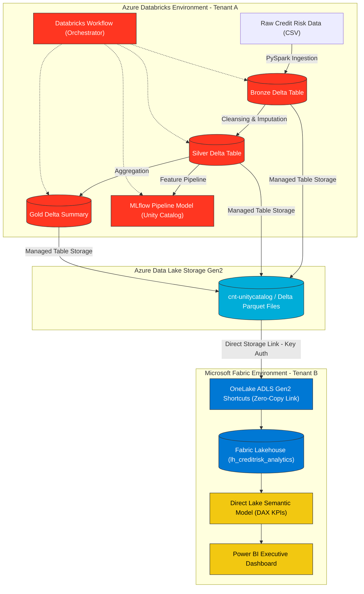
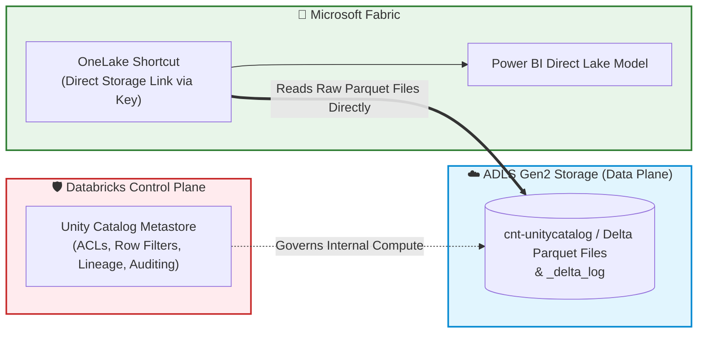

# 🌉 UnityBridge: Cross-Platform Data Lakehouse Architecture
### *Zero-Copy Data Sharing & Analytics: Azure Databricks (Unity Catalog) ↔ Microsoft Fabric (OneLake & Direct Lake)*

[](https://azure.microsoft.com/en-us/products/databricks)
[](https://www.microsoft.com/en-us/microsoft-fabric)
[](https://powerbi.microsoft.com/)
[](https://spark.apache.org/)
[](https://delta.io/)
[](https://mlflow.org/)

---

## 📺 Project Demo Video
> 🎥 **Walkthrough & Pipeline Demo:**  
> [](YOUR_DEMO_VIDEO_LINK_HERE)  
> *(Click the badge above or replace `YOUR_DEMO_VIDEO_LINK_HERE` with your recorded demo video link)*

---

## 📖 Complete Step-by-Step Implementation Guide
For the full click-by-click deployment manual with all PySpark code blocks, configuration parameters, and setup screenshots, refer to:  
👉 [**fabric-databricks-unitybridge-step-by-step.md**](fabric-databricks-unitybridge-step-by-step.md)

---

## 📌 Executive Summary & Motivation

In enterprise analytics ecosystems, a common architectural divide exists:
* **Data Engineering & Machine Learning** teams standardize on **Azure Databricks** with **Unity Catalog** for scalable ETL, complex distributed computing, and ML lifecycle tracking.
* **Business Intelligence & Executive Reporting** teams standardize on **Microsoft Fabric & Power BI** for self-service dashboards and organizational semantic models.

Traditionally, bridging these two environments requires **building redundant ETL copy pipelines**, setting up scheduled batch syncs, and paying double for storage across platforms.

**UnityBridge** demonstrates a modern **Zero-Copy Lakehouse Architecture**:
By leveraging the open **Delta Lake** storage standard on **Azure Data Lake Storage Gen2 (ADLS Gen2)** and **OneLake Shortcuts** in Microsoft Fabric, data is processed once in Databricks and made instantly queryable in Power BI via **Direct Lake mode** without duplicating a single byte.

---

## 🏗️ End-to-End Architecture



---

## 🚀 Key Technical Capabilities

### 1. Medallion Architecture with PySpark
* **Bronze Layer (`bronze_credit_training`):** Ingests raw financial training records (`150,000+` rows) into Delta format with schema preservation.
* **Silver Layer (`silver_credit_training`):** Robust data engineering pipeline that parses literal `"NA"` strings into true SQL `NULL`s, casts columns to strict types (`double`, `integer`), and calculates median-imputed values for missing income.
* **Gold Layer (`gold_credit_age_summary`):** Pre-computes business-critical delinquency metrics binned by customer age cohorts for instant analytical queries.

### 2. MLflow & Unity Catalog Model Governance
* Formatted feature vectors using `pyspark.ml.feature.VectorAssembler`.
* Encapsulated feature engineering and Logistic Regression within a `pyspark.ml.Pipeline`.
* Logged model runs, parameters, metrics, and schema signatures to **Unity Catalog Volumes** using custom `dfs_tmpdir` paths.

### 3. Automated Workflow Orchestration
* Integrated all notebooks into an automated, multi-task **Databricks Workflow Job** (`job-creditrisk-pipeline`) with dependency enforcement (`Run_Bronze` $\rightarrow$ `Run_Silver` $\rightarrow$ `Run_Gold` & `Run_ML`).

### 4. Cross-Tenant Zero-Copy Lakehouse Bridge
* Secured ADLS Gen2 access using Azure Access Connectors & Managed Identities.
* Mounted physical Delta Lake storage directly into a Microsoft Fabric Lakehouse via **OneLake ADLS Gen2 Shortcuts**.
* Completely eliminated cross-platform data movement and duplicated storage costs.

### 5. Direct Lake Business Intelligence (Power BI)
* Created a **Custom Semantic Model** operating purely on **Direct Lake** mode (in-memory query speed directly over Parquet files on cloud storage).
* Built custom DAX metrics for credit risk analytics:
  ```dax
  Total Customers KPI = COUNT(Silver[id])
  Total Delinquent KPI = SUM(Silver[SeriousDlqin2yrs])
  Default Rate KPI % = DIVIDE([Total Delinquent KPI], [Total Customers KPI], 0)
  Average Monthly Income KPI = AVERAGE(Silver[MonthlyIncome])
  Average Debt Ratio KPI = AVERAGE(Silver[DebtRatio])
  ```
* Built an interactive executive dashboard (`rpt-creditrisk-dashboard`) with KPI cards, delinquency cohort analysis, and multi-factor risk scatter plots.

---

## 📂 Repository Structure

```text
├── GiveMeSomeCredit/                         # Raw dataset (cs-training.csv, cs-test.csv)
│   ├── cs-training.csv
│   └── cs-test.csv
├── fabric-databricks-unitybridge-step-by-step.md  # Comprehensive deployment manual
└── README.md                                 # Project documentation
```

---

## 🏷️ Enterprise Resource Naming Standard

Following the **Microsoft Cloud Adoption Framework (CAF)**:

| Resource Type | Resource Name | Purpose |
| :--- | :--- | :--- |
| **Azure Resource Group** | `rg-creditrisk-analytics` | Resource container for all compute & storage |
| **Databricks Workspace** | `dbw-creditrisk-analytics` | Premium workspace with Unity Catalog metastore |
| **ADLS Gen2 Storage** | `stcreditriskanalytics` | Hierarchical namespace storage account |
| **Storage Container** | `cnt-unitycatalog` | Root container for Unity Catalog managed tables |
| **Access Connector** | `id-unitybridge-connector` | Azure Managed Identity for Databricks IAM |
| **Storage Credential** | `cred-unitycatalog-storage` | Unity Catalog security credential |
| **External Location** | `extloc-unitycatalog-storage` | Registered storage location in Unity Catalog |
| **Unity Catalog** | `credit_analytics` | 3-level namespace root catalog |
| **Unity Catalog Schema** | `credit_risk` | Database schema for credit risk data |
| **Databricks Job** | `job-creditrisk-pipeline` | Multi-task automated pipeline orchestrator |
| **Fabric Workspace** | `fws-creditrisk-analytics` | Microsoft Fabric capacity workspace |
| **Fabric Lakehouse** | `lh_creditrisk_analytics` | Lakehouse holding OneLake shortcuts |
| **Semantic Model** | `sm-creditrisk-analytics` | Direct Lake dataset with DAX measures |
| **Power BI Dashboard** | `rpt-creditrisk-dashboard` | Executive reporting layer |

---

## 🛡️ Deep Dive: Governance, Unity Catalog & Cross-Platform Security Boundaries

> ### ⚠️ An Honest Architectural Limitation
> *"Going straight to the storage layer via OneLake Shortcuts skips Unity Catalog's governance engine. For anything beyond an isolated prototype, that access control perimeter must be explicitly re-architected on the Microsoft Fabric side."*

To truly understand why this limitation exists and how real enterprise data architects design around it, we must analyze the distinction between the **Control Plane (Metadata & Governance)** and the **Data Plane (Storage Files)**.

---

### 1. What is Databricks Unity Catalog & How Does It Work?
**Unity Catalog (UC)** is Databricks' centralized multi-cloud governance layer for data and AI assets. It introduces a **3-level namespace** (`catalog.schema.table / volume / model`) and operates as a secure **Control Plane**:

```
[User / BI Query] 
       │
       ▼ (1. Authenticates & requests permission)
┌─────────────────────────────────────────────────────────────┐
│ 🛡️ Unity Catalog Metastore (Control Plane / Governance Engine)│
│  - Evaluates Role-Based Access Control (RBAC)               │
│  - Enforces Dynamic Column Masking & Row-Level Filters (RLS) │
│  - Records Audit Trails & End-to-End Data Lineage           │
└──────────────────────────────┬──────────────────────────────┘
                               │ (2. Generates short-lived credentials)
                               ▼
┌─────────────────────────────────────────────────────────────┐
│ 📦 ADLS Gen2 Storage Account (Data Plane / Physical Storage) │
│  - Raw Parquet Files & `_delta_log` Transaction History     │
└─────────────────────────────────────────────────────────────┘
```

#### What Happens Inside Databricks with Unity Catalog:
* **No Direct Storage Keys:** Users and Spark clusters **never** get direct access keys to the raw ADLS Gen2 storage account.
* **Dynamic Security Enforcement:** If an analyst only has permission to view customers in California, Unity Catalog dynamically rewrites the query or applies row filters before reading files from disk.
* **Lineage & Audit Tracking:** Every single `SELECT`, `UPDATE`, or `DROP` is permanently logged into central system tables.

---

### 2. The Trade-Off: What Happens When We Mount ADLS Gen2 directly in Fabric?

When Microsoft Fabric connects to ADLS Gen2 using a **OneLake Storage Shortcut** (via Storage Account Keys), **it accesses the Data Plane directly**, bypassing the Databricks compute engine and Unity Catalog Metastore entirely:



#### What Works Seamlessly:
* ✅ **Zero-Copy Delta Lake Compatibility:** Because Delta Lake is an open standard, Fabric reads the transaction log (`_delta_log`) and Parquet data perfectly without ETL duplication.
* ✅ **Direct Lake In-Memory Speed:** Power BI loads the Parquet files directly into Analysis Services memory with blazing performance.

#### What Does NOT Flow Across the Boundary:
* ❌ **Unity Catalog Access Grants:** Permissions granted via `GRANT SELECT ON TABLE` in Databricks do not exist in Fabric.
* ❌ **Row Filters & Column Masks:** If sensitive columns (e.g., SSN, income) are masked in Unity Catalog, Fabric will read the unmasked raw storage file unless secured on the Fabric side.
* ❌ **Centralized Audit Lineage:** Queries run from Power BI/Fabric will show in Azure Storage access metrics, but will not appear in Databricks Unity Catalog audit logs.

---

### 3. Production Enterprise Mitigation Strategies

In real-world enterprise architectures, how do data engineering teams bridge this governance gap?

1. **Re-architecting Governance in Microsoft Fabric (Adopted Pattern):**
   * Implement **Workspace Roles (Viewer/Contributor)** and **Lakehouse item permissions** to control who can query the shortcut.
   * Configure **Row-Level Security (RLS)** and **Object-Level Security (OLS)** inside the Power BI Semantic Model to enforce downstream business access boundaries.
2. **Federated Enterprise Tenant Pairing (Mirrored Catalog):**
   * If both environments exist within the same corporate Entra ID tenant with administrative permissions, utilizing Fabric's **Mirrored Azure Databricks Catalog** feature allows Fabric to query the Unity Catalog metadata API directly.
3. **Open Delta Sharing Protocol:**
   * Configure Databricks Unity Catalog as a **Delta Sharing Provider** and Microsoft Fabric as a **Delta Sharing Recipient**. This allows Unity Catalog to dynamically generate scoped, short-lived tokens and enforce table-level sharing contracts across external organizations.

---

### 💡 Summary: Why This Distinction Matters
Demonstrating an understanding of **Storage-Layer Interoperability vs. Control-Plane Governance** reflects senior-level data architecture maturity. Building a zero-copy data bridge proves technical feasibility; understanding the security boundaries proves enterprise readiness.

---

## 👨‍💻 Author & Contact

* Passionate about Lakehouse Architectures, Distributed Computing (Spark/Databricks), and Modern BI Platforms (Fabric/Power BI).
* Connect with me on [LinkedIn](https://www.linkedin.com/in/thathsara-rajapaksha-834bb2257/) 
